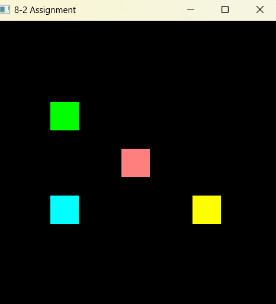
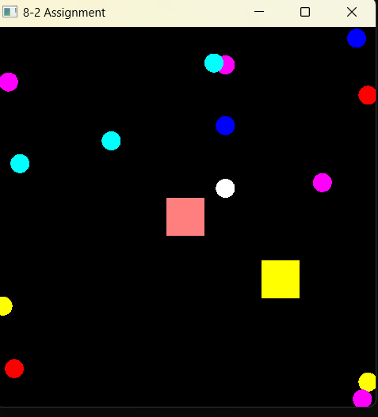
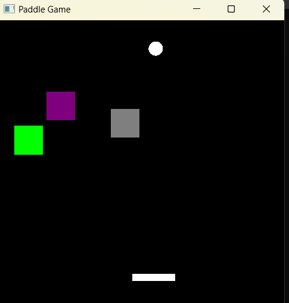
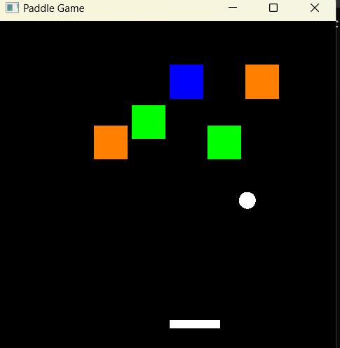
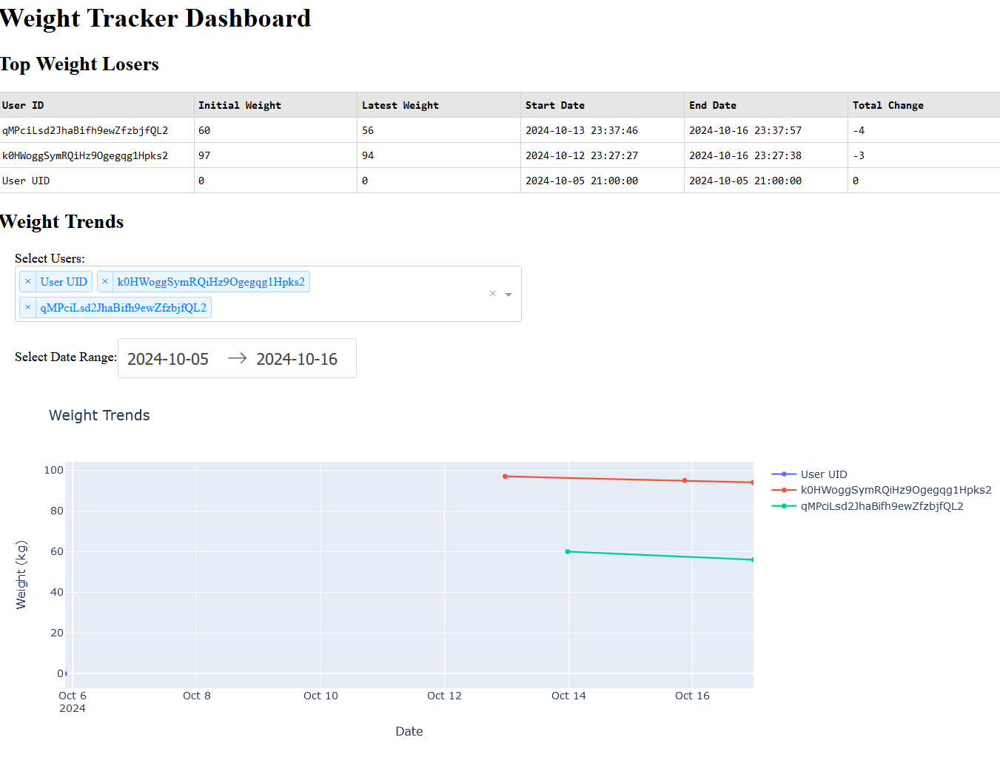

# CS-499 Capstone ePortfolio

## Course Outcomes

Throughout my ePortfolio I hope to demonstrate some of my skills as well as  knowledge of computer science and meet the following outcomes:

* Employ strategies for building collaborative environments that enable diverse audiences to support organizational decision making in the field of computer science
* Design, develop, and deliver professional-quality oral, written, and visual communications that are coherent, technically sound, and appropriately adapted to specific audiences and contexts
* Design and evaluate computing solutions that solve a given problem using algorithmic principles and computer science practices and standards appropriate to its solution, while managing the trade-offs involved in design choices
* Demonstrate an ability to use well-founded and innovative techniques, skills, and tools in computing practices for the purpose of implementing computer solutions that deliver value and accomplish industry-specific goals
* Develop a security mindset that anticipates adversarial exploits in software architecture and designs to expose potential vulnerabilities, mitigate design flaws, and ensure privacy and enhanced security of data and resources

## Informal Code Review

### Overview

My code review video contains all three origianl artifacts. I analyze each artifact separately for problems and enhancements.
The basis of my code review focuses on three critical elements:

- Existing functionality: A detailed walk-through of the existing code focused on the features and function of the current code.
- Code Analysis: Target areas of improvement in structure, logic, efficiency, functionality, security, testing, commenting, and documenting.
- Enhancements: A walk-through of planned enhancements that address issues raised in the code analysis.

### Code Review Video

<iframe width="560" height="315" src="https://www.youtube.com/embed/4MZ7GAVOqXw" frameborder="0" allow="autoplay; encrypted-media" allowfullscreen></iframe>

## Artifact 1: Software Engineering and Design

### Introduction

The artifact is an enhanced version of a project from the CS330 Computer Visualizations course. Originally created as part of my coursework. 
it's a graphics programming project using OpenGL and GLFW to render dynamic graphical elements such as circles (balls), bricks. My enhancement includes a user-controlled controlled paddle, which adds interactivity to the game as well as improving the codebase OOP design. This significantly expands on the original coursework.

[Software Engineering & Design Narrative](https://github.com/ibra9kadabrah/cs-499/tree/main/Narratives/Software%20engineering%20%26%20Design%20Narrative.docx)

### Original Artifact
- [Original Build Files](https://github.com/ibra9kadabrah/cs-499/tree/main/ArtifactOne/original)

*Figure 1 - Original

*Figure 2 - Original-balls flying around

### Enhanced Artifact
- [Final Build Files](https://github.com/ibra9kadabrah/cs-499/tree/main/ArtifactOne/enhanced)

*Figure 3 - User-controlled paddle

### Conclusion

The project went from something with barely any interactivity, bad OOP due to lack of encapsulation, primitive collision detection, to having a user controlled object, a lose condition, a more realistic collision detection system as well as better maintainability.

## Artifact 2: Algorithms and Data Structure

### Introduction

The artifact is the same as in the previous enhancement. It’s a 2D-graphical program from cs330 computer visualization course, then further enhanced in my former enhancement. After enhancement, it went from a simple 2d graphical program into an interactive brick-breaking game implemented using classes like Brick, Circle (representing the ball), and Paddle

[Algorithms and Data Structures Narrative](https://github.com/ibra9kadabrah/cs-499/tree/main/Narratives/Algorithms%20and%20Data%20Structures%20Narrative.docx)

### Enhanced Artifact
- [Final Build Files](https://github.com/ibra9kadabrah/cs-499/tree/main/ArtifactTwo/enhanced)

*Figure 4 - A randomally generated brick layout

*Figure 4 - A randomally generated brick layout Level 2

### Conclusion

The project became a truly procedurally generated game, with multiple levels, difficulty adjuster, record keeping, significantly enhanced algorithms, more complex, new data structures as well as improvements to collision detection accuracy and performance. This was a very enjoyable experience as well as a great learning opportunity

## Artifact 3: Databases

## Introduction

The Artifact is an android weight tracker app I made for CS360 course. Users are able to set a weight goal, enter daily weight as well as view last 7 days of data. There is also an interactive web-interface.
Use Juypter to interact with web-interface. It is hosted on http://127.0.0.1:8050/ by default
[Database Narrative](https://github.com/ibra9kadabrah/cs-499/tree/main/Narratives/Database%20Narrative.docx)
### Enhanced Artifact
- [Final Build Files](https://github.com/ibra9kadabrah/cs-499/tree/main/ArtifactTwo/enhanced)

*Figure 4 - A randomally generated brick layout
