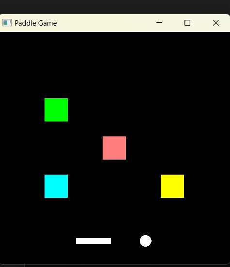

# CS-499 Capstone ePortfolio

## Professional assesment

[Professional Assessment](#professional-assessment)  |  [Artifact One](#artifact-1-software-engineering-and-design)  |  [Artifact Two](#artifact-2-algorithms-and-data-structure)  |  [Artifact Three](#artifact-3-databases)

I began my educational journey at Southern New Hampshire University (SNHU) in January 2023, after taking time off from my previous university to prioritize my mental health. I have been passionate about computers ever since I was a child and have always loved tinkering with them. My passion for computers is the main reason I decided to pursue a bachelor's degree in computer science, with the added goal of pursuing a master’s degree to further my education in this field. I am particularly passionate about graphics, game development, and simulations, which I hope to contribute to in my advanced education and career. During my studies, I not only learned technical skills but also experienced significant personal growth.

> “What a computer is to me is it's the most remarkable tool that we've ever come up with, and it's the equivalent of a bicycle for our minds.” 
 — Steve Jobs

At SNHU, I developed important skills such as researching and citing sources, organizing my thoughts into structured arguments, and developing time management skills—especially crucial since I was handling double the course load for most of my terms.

Through coursework like CS-360 (App Development), I learned about native Android development. At first, this was overwhelming due to the new architecture, development environment, and other complexities. I also learned the importance of adhering to design guidelines, given that different Android phones have varied hardware and software specs. Fortunately, my prior experience with Java, which I gained in another SNHU course, was quite helpful. Another notable course was CS-310 (Collaborative Development), where we worked as a class on a single project, learning how to merge code, resolve conflicts, and pass code reviews. This course gave me a glimpse into real-world work scenarios, with asynchronous collaboration between teams, a skill that will be invaluable in a professional environment. I particularly enjoyed the practical nature of this course.

Another course, CS-330 (Computational Graphics), taught me the principles of graphics, focusing on modeling, lighting, and shaders. This is the type of work I am passionate about, though it was still challenging. It required me to quickly learn OpenGL to overcome various hurdles and implement my projects. OpenGL, while an established graphics API, is quite difficult to master, but learning it to deliver my projects was incredibly valuable for both my career and future aspirations. I used one of the projects from this course for my enhancements below, where I implemented a more realistic collision-detection algorithm with performance in mind.

Lastly, the CS-465 (Full-Stack Development) course highlighted the importance of system architecture in web development, and how choosing the right tech stack (such as the MEAN stack) can directly impact a program’s performance and security. For example, different architectures require different authentication implementations. This course also required me to showcase my detailed understanding of the project's intricacies by writing an extensive design paper and creating various diagrams to demonstrate my understanding.

During my time at SNHU, I believe I have improved my problem-solving skills and my ability to learn quickly—skills I consider separate but equally important. Despite the time constraints, I managed to maintain honor student status. I also developed a security mindset and a strong understanding of testing, both of which are critical as a project grows in complexity. In addition, I gained knowledge in graphics, advanced web development with a focus on architecture, as well as HTML, CSS, JavaScript, Java (Spring), and operating systems, including system calls, assembly, system architecture, and development with C/C++.

I hope my portfolio showcases my hard work at SNHU. I aim to pursue higher education with a focus on graphics and simulation modeling, and I believe the skills I have learned at SNHU, as well as my ePortfolio, will help me in that pursuit

## Course Outcomes

Throughout my ePortfolio I hope to demonstrate some of my skills as well as  knowledge of computer science and meet the following outcomes:

* Employ strategies for building collaborative environments that enable diverse audiences to support organizational decision making in the field of computer science
* Design, develop, and deliver professional-quality oral, written, and visual communications that are coherent, technically sound, and appropriately adapted to specific audiences and contexts
* Design and evaluate computing solutions that solve a given problem using algorithmic principles and computer science practices and standards appropriate to its solution, while managing the trade-offs involved in design choices
* Demonstrate an ability to use well-founded and innovative techniques, skills, and tools in computing practices for the purpose of implementing computer solutions that deliver value and accomplish industry-specific goals
* Develop a security mindset that anticipates adversarial exploits in software architecture and designs to expose potential vulnerabilities, mitigate design flaws, and ensure privacy and enhanced security of data and resources

## Informal Code Review

### Overview

My code review video contains all three origianl artifacts. I analyze each artifact separately for problems and enhancements.
The basis of my code review focuses on three critical elements:

- Existing functionality: A detailed walk-through of the existing code focused on the features and function of the current code.
- Code Analysis: Target areas of improvement in structure, logic, efficiency, functionality, security, testing, commenting, and documenting.
- Enhancements: A walk-through of planned enhancements that address issues raised in the code analysis.

### Code Review Video

<iframe width="560" height="315" src="https://www.youtube.com/embed/4MZ7GAVOqXw" frameborder="0" allow="autoplay; encrypted-media" allowfullscreen></iframe>

## Artifact 1: Software Engineering and Design

### Introduction

The artifact is an enhanced version of a project from the CS330 Computer Visualizations course. Originally created as part of my coursework. 
it's a graphics programming project using OpenGL and GLFW to render dynamic graphical elements such as circles (balls), bricks. My enhancement includes a user-controlled controlled paddle, which adds interactivity to the game as well as improving the codebase OOP design. This significantly expands on the original coursework. The main focus was on enhancing the software engineering and design aspect, I restructured the game's codebase by improving modularity, maintainability.

[Software Engineering & Design Narrative](https://github.com/ibra9kadabrah/cs-499/tree/main/Narratives/Software%20engineering%20%26%20Design%20Narrative.docx)

### Original Artifact
- [Original Build Files](https://github.com/ibra9kadabrah/cs-499/tree/main/ArtifactOne/original)

*Figure 1 - Original

*Figure 2 - Original-balls flying around

### Enhanced Artifact
- [Final Build Files](https://github.com/ibra9kadabrah/cs-499/tree/main/ArtifactOne/enhanced)

*Figure 3 - User-controlled paddle

### Conclusion

The project went from something with barely any interactivity, bad OOP due to lack of encapsulation, primitive collision detection, to having a user controlled object, a lose condition, a more realistic collision detection system as well as better maintainability. This revision made the game not only more maintainable but also positioned it for easier future enhancements. Even silly games can benefit from better software engineering practices :)

## Artifact 2: Algorithms and Data Structure

### Introduction

The artifact is the same as in the previous enhancement. It’s a 2D-graphical program from cs330 computer visualization course, then further enhanced in my former enhancement. After enhancement, it went from a simple 2d graphical program into an interactive brick-breaking game implemented using classes like Brick, Circle (representing the ball), and Paddle. this time focusing on the algorithms and data structures powering the game, by implementing more accurate collision detection while still being performative, extending the data structures used and overall improving the game's responsiveness.

[Algorithms and Data Structures Narrative](https://github.com/ibra9kadabrah/cs-499/tree/main/Narratives/Algorithms%20and%20Data%20Structures%20Narrative.docx)

### Enhanced Artifact
- [Final Build Files](https://github.com/ibra9kadabrah/cs-499/tree/main/ArtifactTwo/enhanced)

*Figure 4 - A randomally generated brick layout

*Figure 5 - A randomally generated brick layout Level 2

### Conclusion

The project became a truly procedurally generated game, with multiple levels, difficulty adjuster, record keeping, significantly enhanced algorithms, more complex, new data structures as well as improvements to collision detection accuracy and performance. This was a very enjoyable experience as well as a great learning opportunity. For this phase of the project I had to consider computational cost of my code. Improving the algorithms and data structures not only optimized the game's performance but also showed how careful selection of these elements can greatly impact the user experience

## Artifact 3: Databases

## Introduction

The Artifact is an android weight tracker app I made for CS360 course. Users are able to set a weight goal, enter daily weight as well as view last 7 days of data. There is also an interactive web-interface where you can see top weight losers, and weight trends. This project is a comprehensive project that needed work with both front-end and back-end technologies, It required the use of a modern cloud-based backend like firebase, java for front-end, JSON, as well
python and jupyter for data analysis and visualizations in the interface

Use Juypter to interact with web-interface. It is hosted on http://127.0.0.1:8050/ by default

[Database Narrative](https://github.com/ibra9kadabrah/cs-499/tree/main/Narratives/Database%20Narrative.docx)
### Enhanced Artifact
- [Final Build Files](https://github.com/ibra9kadabrah/cs-499/tree/main/ArtifactThree/enhanced)

*Figure 6- web interface

*Figure 7 - App interface

### Conclusion

With this enhancement, the weight tracker app, went from an app that used a simple sqllite databaes to using firebase firestore. It also used plain text local authnetication, while now it uses firebase authentication with encryption in storage and in flight. I also added a user interface so you can view users weight, weight changes, as well as weight trends over time. This was a comprehensive experience as it required native android development and web-development skills.

[Professional Assessment](#professional-assessment)  |  [Artifact One](#artifact-1-software-engineering-and-design)  |  [Artifact Two](#artifact-2-algorithms-and-data-structure)  |  [Artifact Three](#artifact-3-databases)